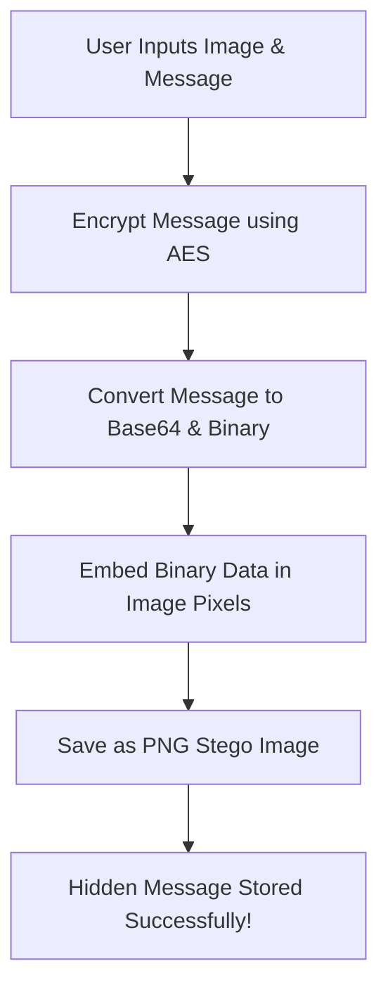
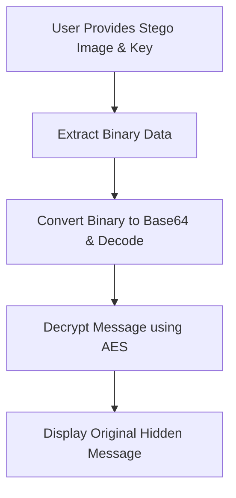

# 🔐 Image Steganography with AES Encryption


## 📌 Overview
This project implements **Image Steganography** with **AES Encryption** using Python.
It allows users to securely **hide** and **extract** secret messages inside images without noticeable changes.
The project supports both **JPEG** and **PNG** formats, with automatic conversion for reliability.

---

## ✨ Features
- ✅ **Image Support:** Works with PNG and JPEG images (JPEGs are converted to PNG to prevent compression issues).
- ✅ **AES Encryption:** Ensures secure message embedding using a 16-character key.
- ✅ **Base64 Encoding:** Safely encodes the encrypted message.
- ✅ **EOF Marker:** Efficient message extraction without corruption.
- ✅ **User-Friendly CLI:** Simple interface to hide and extract messages.

---

## 🚀 Getting Started

### 1️⃣ Prerequisites
Ensure you have the following installed:
- **Python 3.x**
- **pip**

### 2️⃣ Installation
Clone the repository and install the dependencies:
```bash
git clone https://github.com/your-username/steganography-aes.git
cd steganography-aes
pip install -r requirements.txt
```

### 3️⃣ Usage
Run the main Python script to choose between hiding and extracting messages:
```bash
python main.py
```

- **Option 1**: Hide a secret message inside an image.
- **Option 2**: Extract the hidden message using the correct decryption key.

---

## 📂 Project Structure
```plaintext
SteganographyProject/
│── main.py
│── src/
│   ├── __init__.py
│   ├── config.py
│   ├── gui.py
│   ├── utils.py
│   ├── hide.py
│   ├── extract.py
│   ├── crypto_utils.py
│── requirements.txt
│── README.md
```

---

## 📊 Workflow:

### 🔵 **Hiding Process**


### 🔴 **Extraction Process**


---

## 🛠 Technologies Used
- **Python 3.xx
- **OpenCV** - Image processing
- **PyCryptoDome** - AES Encryption/Decryption
- **Base64** - Encoding and decoding

---

## 🧑‍💻 Contribution
Contributions are welcome! If you'd like to improve this project, feel free to:
- Fork the repo
- Create a new branch
- Submit a pull request

---

## 📝 License
This project is licensed under the **MIT License**.

---

> **Made with ❤️ for secure and reliable communication.**

